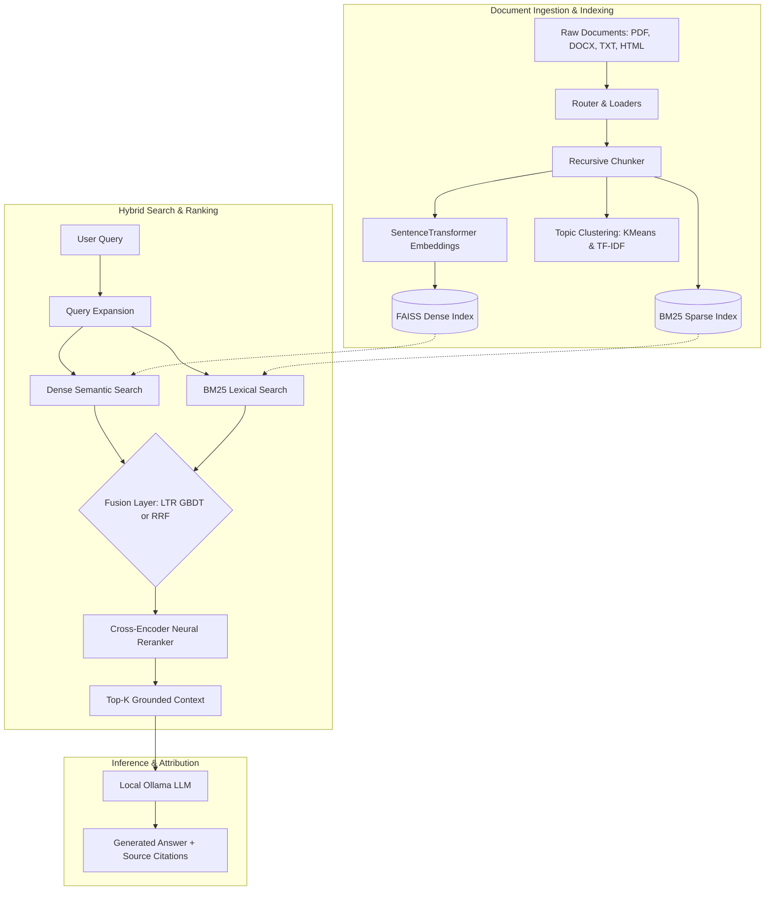
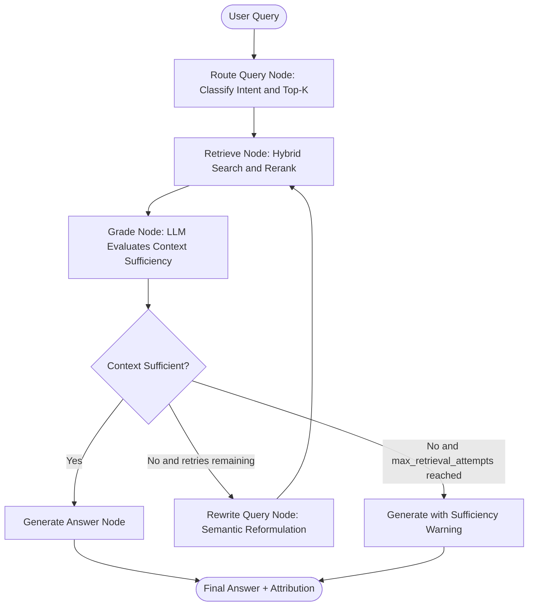
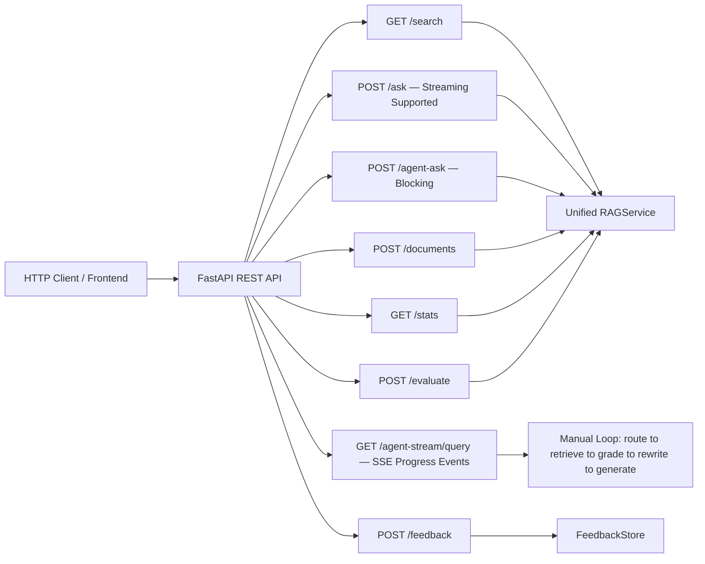
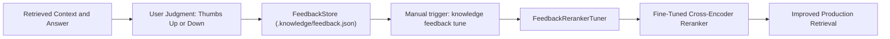
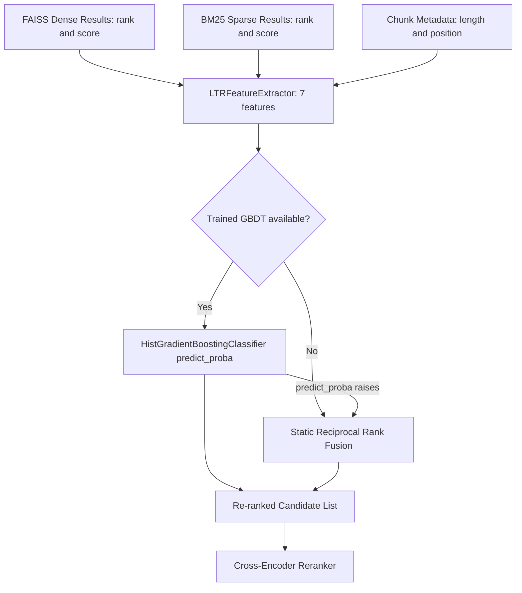
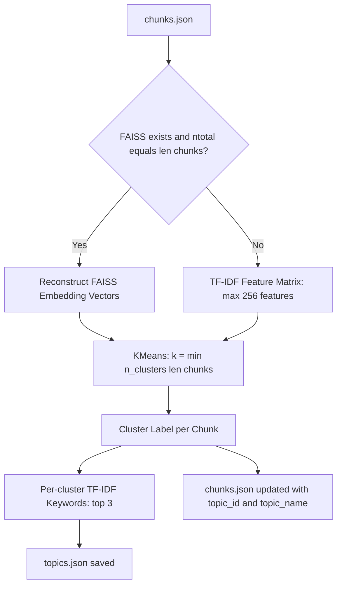

# RAGForge System Architecture

RAGForge is a modular, production-inspired Retrieval-Augmented Generation (RAG) framework with hybrid retrieval, neural reranking, agentic self-correction, domain fine-tuning, and active learning.

---

## 1. End-to-End Hybrid RAG Pipeline

---

## 2. Agentic Self-Correcting Graph Layer (LangGraph)

The agent layer introduces query intent classification, retrieval sufficiency grading, and automated query rewriting. A configurable hard cap (`max_retrieval_attempts` in `config.yaml`, default 3) ensures the rewrite loop always terminates.

> **Retry hard cap:** `should_continue()` checks `rewrite_count >= max_retries` before returning `"rewrite"`. The `max_retries` value is seeded from `AppConfig.max_retrieval_attempts` (default 3) and passed through `AgentState`, so it can never be exceeded regardless of LLM grading behavior.

---

## 3. FastAPI REST Service Architecture

The REST API exposes pipeline operations as asynchronous endpoints sharing the unified `RAGService` layer with the Typer CLI. The `/agent-stream` endpoint provides SSE progress events during agentic retrieval cycles.

**SSE event sequence for `/agent-stream/{query}`:** `start` → `retrieved` → `graded` → (optional) `rewriting` → `start` → … → `answer`. Each event is a newline-delimited JSON object.

---

## 4. Active Learning & Feedback Loop

> **Manual trigger note:** `knowledge feedback tune` is **intentionally manual**. Feedback accumulates in `.knowledge/feedback.json` across sessions. Run `tune` once you have collected enough samples (default threshold: 2). It does not trigger automatically after each `feedback up/down` call. A future `--watch` flag is planned but not yet implemented.

---

## 5. Learning-to-Rank Fusion

The LTR layer combines dense and sparse retrieval signals into a feature vector and re-ranks candidates using a trained GBDT classifier, with automatic fallback to static RRF when no model is loaded or inference fails.

---

## 6. Topic Clustering

Unsupervised KMeans groups indexed chunks by theme using FAISS embedding vectors when available, with TF-IDF fallback when the index is absent or mismatched.

