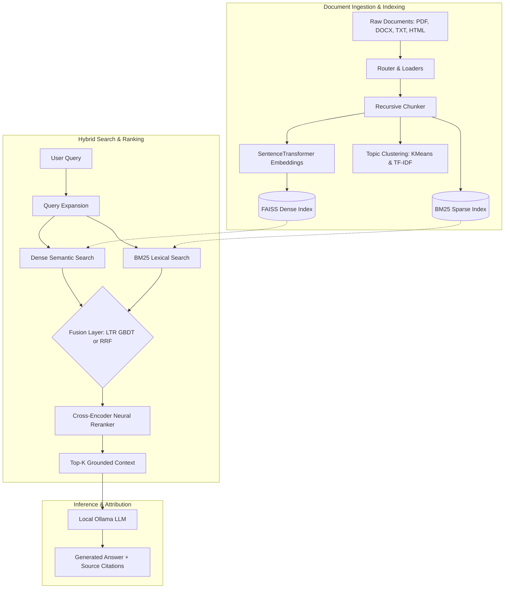
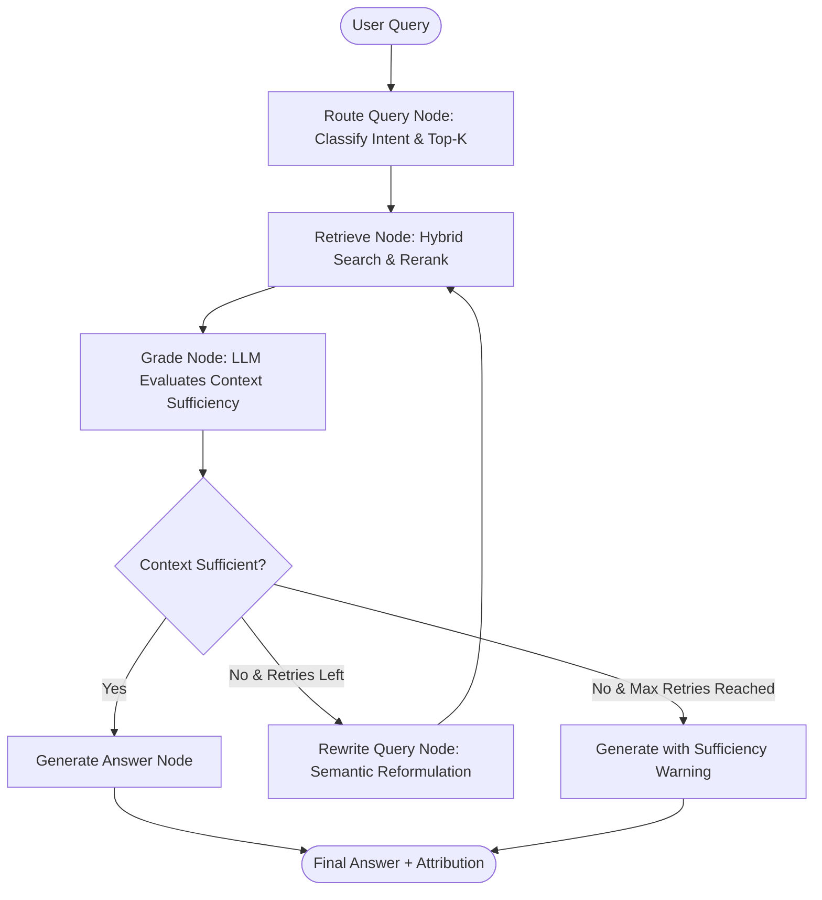
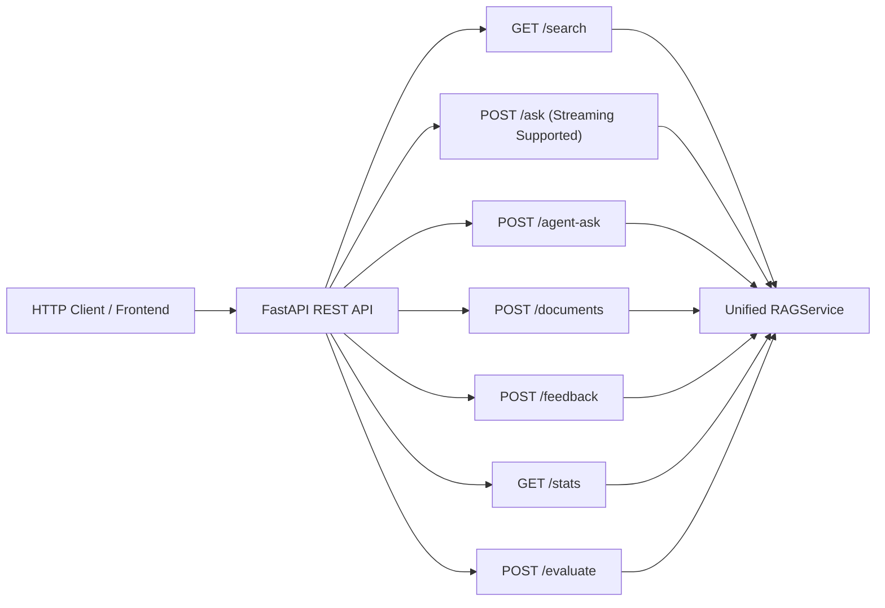
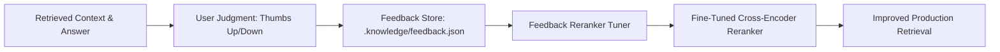

# RAGForge System Architecture

RAGForge is a modular, production-inspired Retrieval-Augmented Generation (RAG) framework with hybrid retrieval, neural reranking, agentic self-correction, domain fine-tuning, and active learning.

---

## 1. End-to-End Hybrid RAG Pipeline

---

## 2. Agentic Self-Correcting Graph Layer (LangGraph)

The agent layer introduces query intent classification, retrieval sufficiency grading, and automated query rewriting.

---

## 3. FastAPI REST Service Architecture

The REST API exposes pipeline operations as asynchronous endpoints sharing the unified `RAGService` layer with the Typer CLI:

---

## 4. Active Learning & Feedback Loop

User feedback continually enhances retrieval accuracy through fine-tuning:

